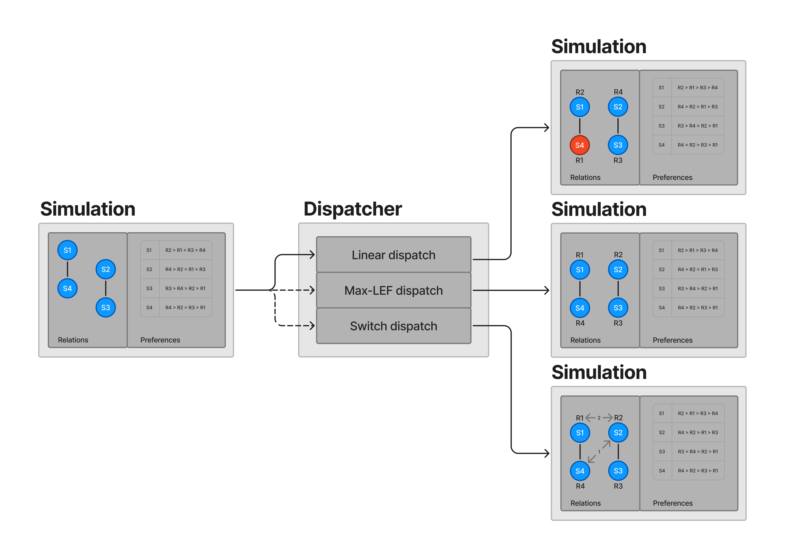

# JSS
“Jealous Space Settlers” is a program simulating the distribution of resources to a group of space settlers.

## Context
This code is produced as part of a third year Bachelor degree mini-project.
The principal objectives were to acquire the ability to model problems within a OOP paradigm as a means of problem-solving
and to gain proficiency in the use of the Java programming language.

## Story
After each supply mission, the chief of a space colony must distribute critical resources among the settlers (colonists).
It is the responsibility of the chief to ensure that each settler receives one of these critical resources
(e.g. essential equipment or food rations).
In order to maintain harmony within the colony, the commander must ascertain each member's preferences for the allocated resources
and endeavour to respect them as far as is possible.
In addition to these preferences, the commander must consider the relationships between the settlers.
Some of them have poor relations with one another, and an unequal distribution of resources could result in conflict
or jeopardise the colony's survival.

# Installation

Download the latest version of the `.jar` file in [release section](https://github.com/pacotine/JSS/releases/tag/v1.0.0) of this repository then you can run the application
with the following command: 
```
java -jar path/to/JSS.jar
```
You can add arguments to the command to specify a file to read the colony from:
```
java -jar path/to/JSS.jar path/to/the/file.txt
```
By default, if no arguments are given, the application will ask you to create the colony manually.

# File format

The colony file follows a specific format. See an example in [assets](https://github.com/pacotine/JSS/blob/main/assets/colony.txt).
You have to add the following lines in this precise order:

- First, specify the settlers:
```
colon(settler_name).
```

- Second, add as many resources as settlers:
```
ressource(resource_name).
```
- Then, you can set bad relations between settlers (this is optional):
```
deteste(settler_name,settler_name).
```
- Finally, write for each settler the resources in order of preference:
```
preferences(settler_name,resource_name,...).
```

Note that the `.` at the end of each line is mandatory.


# Problem-solving
## Model
A simulation is the set of [resource allocation problem](https://en.wikipedia.org/wiki/Resource_allocation").
Given a set of agents $N=\{1, \dots, n\}$ and a set of indivisible resources $O=\{o_{1}, \dots, o_{r}\}$,
the number of resources is equal to the number of agents, _i.e._, $r = n$, and each settler
$i \in N$ should receive exactly one resource $o \in O$.

## Dispatch
One of the primary challenges of this project was to identify an effective method for allocating resources to the settlers. 
The objective was to ensure that the allocation of resources would have a minimal impact on the number of settlers who might be envious.

In order to achieve this, we have implemented two algorithms.


### Linear Dispatch
The most straightforward method for allocating resources to settlers is through linear dispatch. 
This approach involves assigning the most desired resource that is still available to each settler, in a sequential manner.
In reality, this process is $O(n)$ complex, with a significant drawback in that it fails to reduce the number of envious settlers.

### _**MAX-LEF**_ Dispatch
_**MAX-LEF**_ stands for _Maximum Local Envy Freeness_. It is an algorithm described in [this thesis paper](https://theses.hal.science/tel-03222104v1/document) by Anaëlle Wilczynski [[Section 4.4](https://theses.hal.science/tel-03222104v1/document#section.4.4)].
The main idea is to choose a specific order to apply a linear dispatch process that minimises local point conflicts by determining an independent set of settlers
in the relationships graph.

This algorithm is known to be NP-complete 
(as is the _**DEC-LEF**_ algorithm, which determines whether there is a solution without any jealousy),
so we use an approximation algorithm.
For a maximization problem, an algorithm is $p$-approximate, with $p \in [0, 1]$, if it outputs a solution
whose value is at least $p$-times the optimal value, for any instance.
More precisely, the algorithm implemented here is a $\frac{|I|}{n}$-approximate algorithm of _**MAX-LEF**_.
So, in order to obtain better results and tend towards the optimal, we repeat this algorithm on various instances
of the simulation with a different running order each time
(each instance can give a different set of independent settlers $I$, and thus play on the result).

We believe this to be the best possible solution to the problem in a realistic time complexity.
This approach represents an optimal compromise between the time required for execution and the level of satisfaction with the result.